# Sequence diagram specifications

Requirement identifiers are not reliably recoverable from source; each related UC is named and marked for document confirmation.

## SD-01 Register Account

1. **Related UC:** Registration (`Needs document confirmation`).
2. **Lifelines:** Guest, AuthScreen, AuthController, RunnaApi, auth router, AuthService, SQLAlchemy Session, PostgreSQL.
3. **Preconditions:** API available; roles seeded.
4. **Main:** UI validates nonempty form → controller/API POST → Pydantic validates → service checks username/email and member role → hashes password → inserts/commits/refreshes → serializes user → controller stores current user only after login, not registration.
5. **Alternative:** duplicate username/email → 400. 6. **Exception:** invalid fields 422; missing role 500. 7. **DB:** SELECT user/role; INSERT user. 8. **Authorization:** public; role forced member. 9. **External:** none. 10. **Result:** account exists. 11. **Sources:** `auth_screen.dart:87-110`; `auth_controller.dart:57-71`; `runna_api.dart:30-52`; `auth.py:26-30`; `auth_service.py:26-48`.

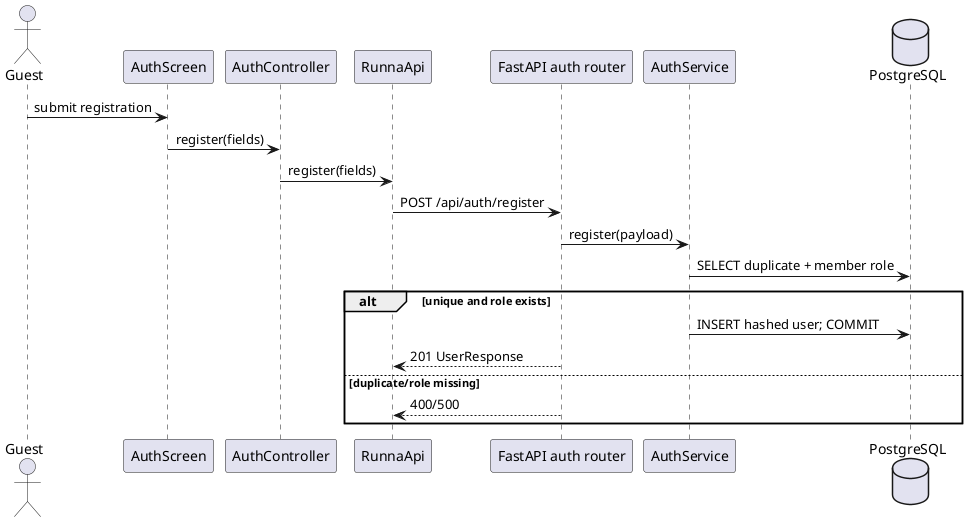
```mermaid
sequenceDiagram
actor Guest
participant UI as AuthScreen
participant C as AuthController
participant M as RunnaApi
participant A as FastAPI auth router
participant S as AuthService
participant DB as PostgreSQL
Guest->>UI: Submit registration
UI->>C: register(fields)
C->>M: register(fields)
M->>A: POST /api/auth/register
A->>S: register(payload)
S->>DB: SELECT duplicate and member role
alt valid
S->>DB: INSERT user; COMMIT
A-->>M: 201 UserResponse
else invalid state
A-->>M: 400 or 500
end
```

## SD-02 Log In

UC Login. Preconditions account exists. Main: submit username/email and password; user lookup; PBKDF2 verify; JWT (`sub`,`exp`) returned; controller stores token then calls `/api/me`, persists token, notifies UI. Alternative bad credentials 401. Exception inactive user can receive token because login omits active check, but `/me` rejects it and controller clears session. DB SELECT User twice. Public login; authenticated `/me`. No external service. Result authenticated local session. Sources: `auth_screen.dart:66-85`, controller `73-86`, API `54-70,104-113`, service `50-60,173-186`.

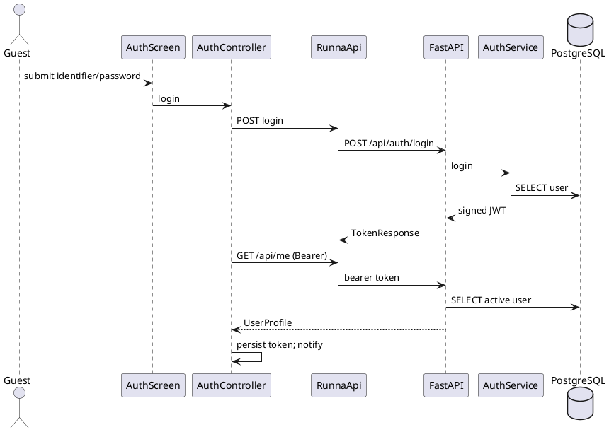
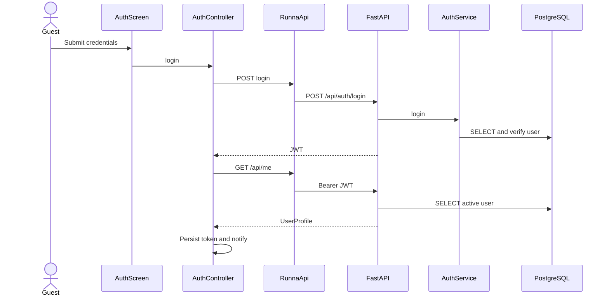

## SD-03 Request Password Reset

UC Forgot Password. Public. Main: EmailStr → active case-insensitive user locked → old unused codes marked used → hashed six-digit code inserted/committed → SMTP after lock release → successful delivery timestamp committed → identical 200. Unknown/inactive email returns same response/no write. SMTP disabled/failure marks record used. DB prepare/delivery exceptions roll back and router logs fixed message then still 200. Sources: auth UI `112-298`, API `72-81`, router `42-51`, service `62-123`, email `11-42`.

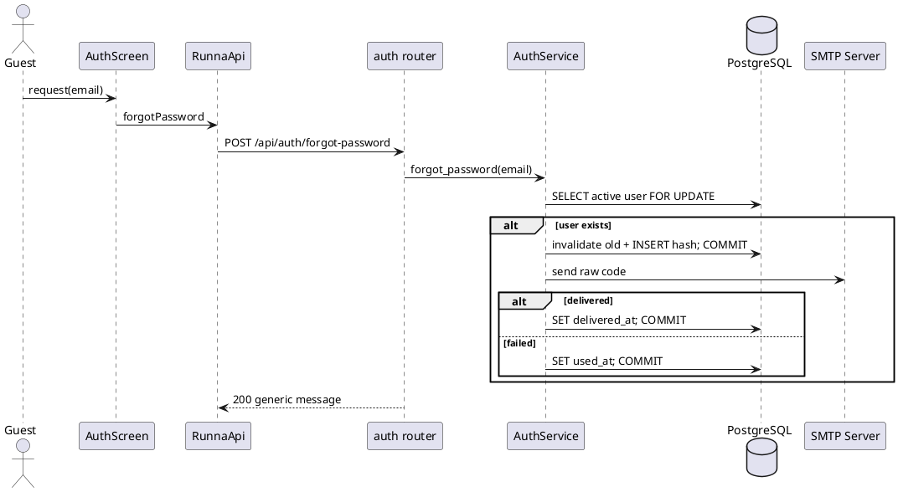
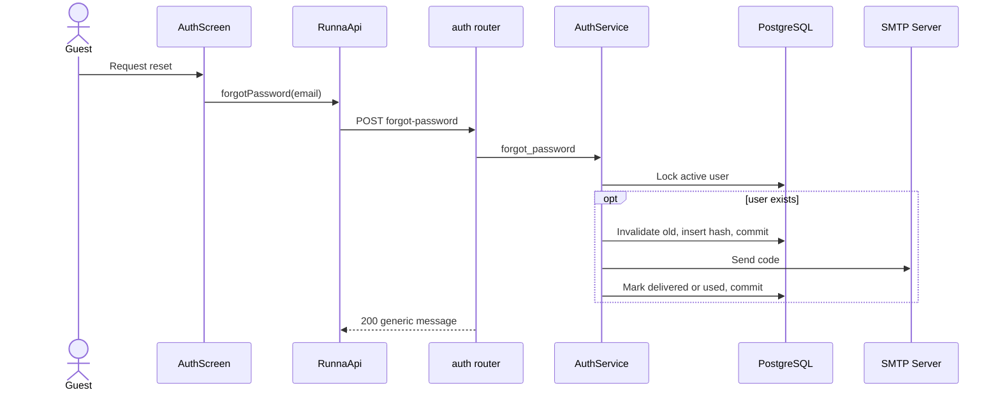

## SD-04 Reset Password

UC Reset Password. Preconditions delivered, unused, unexpired OTP. Main: validate matching passwords/six digits → lock active user and latest eligible code → ensure attempts `<5` → PBKDF2 verify → update password hash and invalidate all codes → single commit. Wrong code increments and commits; expired/used/undelivered/user mismatch returns generic 400; fifth prior failures block. Exception rolls back, router sanitizes. No SMTP. Sources: UI `112-298`, API `83-102`, schema `auth.py:21-32`, service `125-170`.

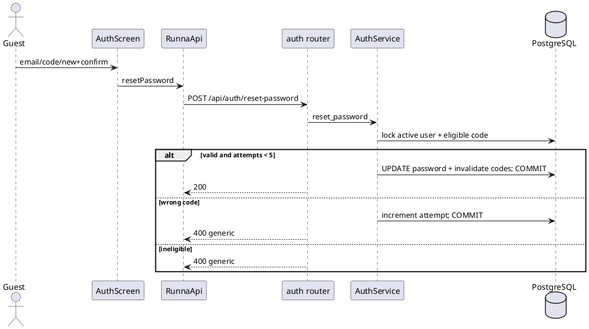
```mermaid
sequenceDiagram
actor Guest
participant UI as AuthScreen
participant M as RunnaApi
participant A as auth router
participant S as AuthService
participant DB as PostgreSQL
Guest->>UI: Submit reset
UI->>M: resetPassword
M->>A: POST reset-password
A->>S: reset_password
S->>DB: Lock active user and code
alt valid
S->>DB: Update password and invalidate codes; commit
A-->>M: 200
else wrong/ineligible
S->>DB: Increment attempt when wrong; commit
A-->>M: 400 generic
end
```

## SD-05 Create and Save Custom Route

UC Create/Save Custom Route. Preconditions active bearer; at least two local taps. Main screen accumulates points, POSTs name/points; service validates count, calculates distance, optionally snaps against map edges and builds validation, stores JSON strings, commit/refresh, reloads list. Alternative Clear Points is local-only and sends nothing. Exception 400 fewer than two; 401 inactive; 422 schema. Sources `routes_screen.dart:69-139`, controller `147-162`, API `173-202`, map router `99-107`, service `217-289`.

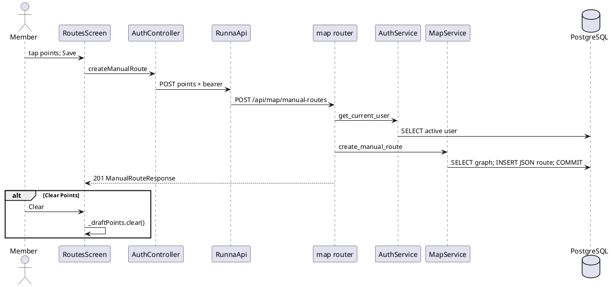
```mermaid
sequenceDiagram
actor Member
participant UI as RoutesScreen
participant C as AuthController
participant M as RunnaApi
participant A as map router
participant D as Auth dependency
participant S as MapService
participant DB as PostgreSQL
Member->>UI: Tap points and Save
UI->>C: createManualRoute
C->>M: POST points with bearer
M->>A: POST /api/map/manual-routes
A->>D: get_current_user
D->>DB: SELECT active user
A->>S: create_manual_route
S->>DB: Read graph; insert JSON route; commit
A-->>UI: 201 route
opt Clear Points instead
Member->>UI: Clear
UI->>UI: Clear local draft only
end
```

## SD-06 Delete Saved Route

UC Delete Saved Route. Active bearer; route exists and owned. UI DELETE; service loads route, returns 404 for missing/nonowner, sets every referencing Run.manual_route_id null, hard-deletes route, commits; UI reloads. No external call. Sources screen `141-155`, API `204-213`, router `110-117`, service `296-305`.

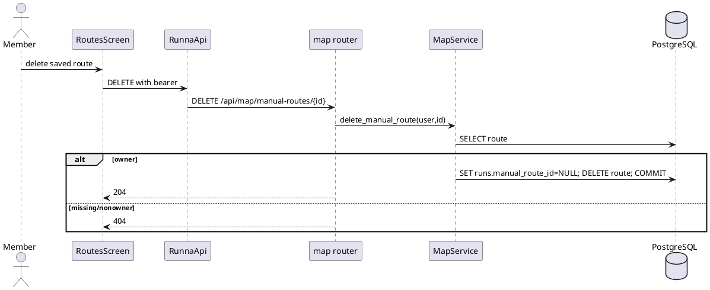
```mermaid
sequenceDiagram
actor Member
participant UI as RoutesScreen
participant M as RunnaApi
participant A as map router
participant S as MapService
participant DB as PostgreSQL
Member->>UI: Delete route
UI->>M: DELETE bearer
M->>A: DELETE /api/map/manual-routes/{id}
A->>S: delete_manual_route
S->>DB: SELECT route
alt owner
S->>DB: Null run references; hard delete; commit
A-->>UI: 204
else not owner/not found
A-->>UI: 404
end
```

## SD-07 Create Hazard Pin

UC Create Hazard Pin. Preconditions active bearer and selected map point. UI supplies category, severity, optional note; Pydantic validates string lengths/severity only; service inserts active marker with user ID and commits. 401/422/DB 500 alternatives. Sources hazards `69-106`, API `132-155`, router `78-86`, service `192-205`.

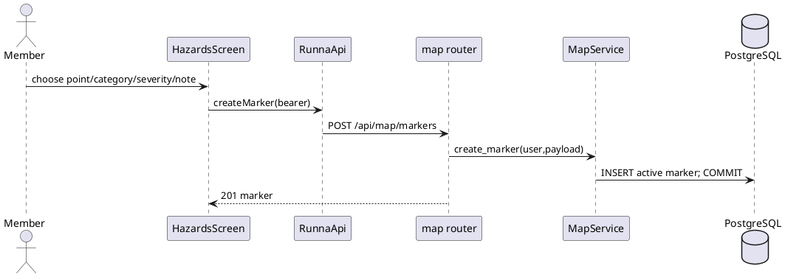
```mermaid
sequenceDiagram
actor Member
participant UI as HazardsScreen
participant M as RunnaApi
participant A as map router
participant S as MapService
participant DB as PostgreSQL
Member->>UI: Select point and details
UI->>M: createMarker with bearer
M->>A: POST /api/map/markers
A->>S: create_marker
S->>DB: Insert active marker; commit
A-->>UI: 201 marker
```

## SD-08 View Hazard Pins

UC View Hazard Pins. Public; screen/API GET; service marks expired lifecycle pins then returns nonremoved, nonexpired list; DTOs displayed on map/list. Alternative empty list. Exception network/server error shown. DB read and possible expiry update/commit (PII underlying behavior). Sources hazards `52-67`, API `123-130`, router `71-75`, service `207-215`.

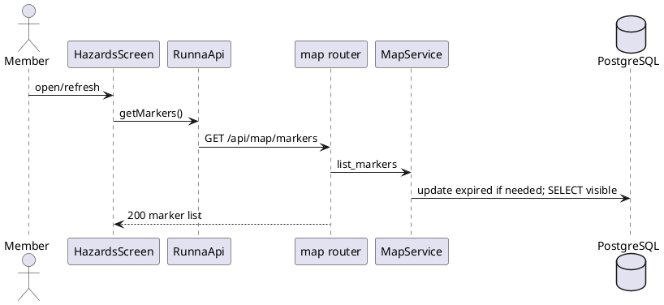
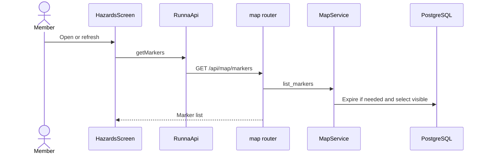

## SD-09 Generate AI Run Summary

UC Generate/View AI Run Summary. No standalone generate action exists. Preconditions authenticated owner with active run; finishing is PII substrate. Router calls finish; service computes metrics/recent runs, `AnalysisService` builds summary and may call Gemini; saves insight/reasoning/recommendations; response/UI displays. Gemini unavailable stores error-derived text and still commits; unexpected exception text is stored/logged/printed. Sources runs screen `448-487,988-1008`, API `287-305`, router `67-79`, run service `123-259`, analysis `41-255`.

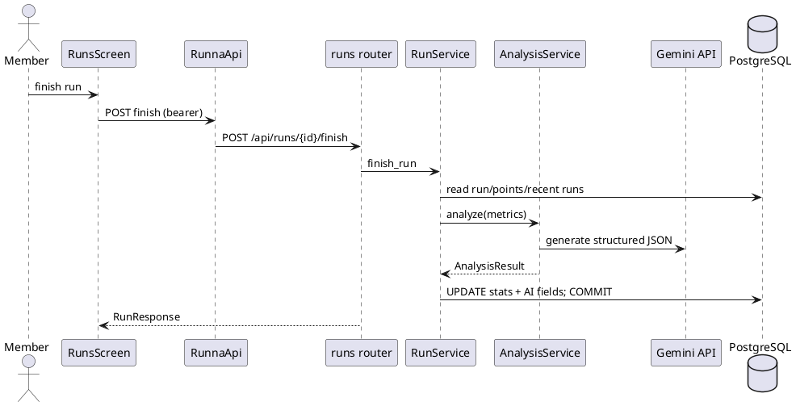
```mermaid
sequenceDiagram
actor Member
participant UI as RunsScreen
participant M as RunnaApi
participant A as runs router
participant S as RunService
participant AI as AnalysisService
participant G as Gemini API
participant DB as PostgreSQL
Member->>UI: Finish run
UI->>M: POST finish
M->>A: POST /api/runs/{id}/finish
A->>S: finish_run
S->>DB: Read run, points, history
S->>AI: analyze metrics
AI->>G: Generate JSON when configured
G-->>AI: Response or failure
AI-->>S: AnalysisResult
S->>DB: Save stats and AI fields; commit
A-->>UI: RunResponse
```

## SD-10 Manage Users

UC Admin User Management. Preconditions active admin token. Admin UI loads list; dependency reloads active user; `require_admin`; service outer-join list. Toggle/role action PATCHes optional fields; service loads target/role, commits/refreshes, route builds counts and UI reloads. 401 inactive/invalid token, 403 nonadmin, 404 target, 400 role; schema permits only member/admin. No self/last-admin guard or revocation. Sources admin UI `64-111`, API `353-383`, router `42-74`, service `20-26,50-104`.

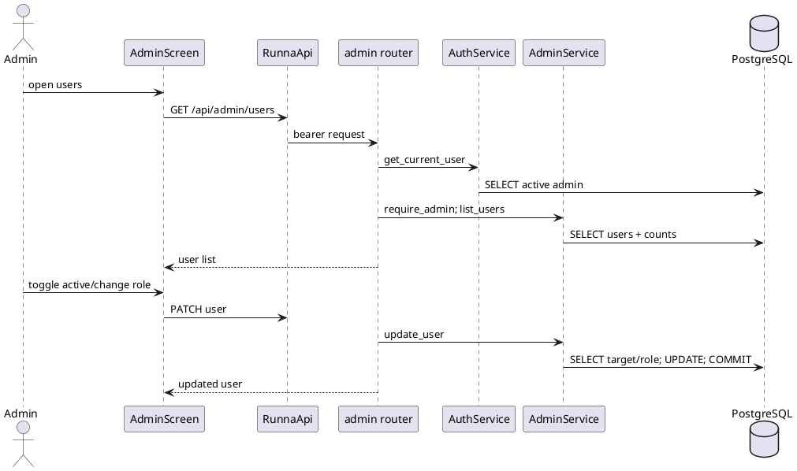
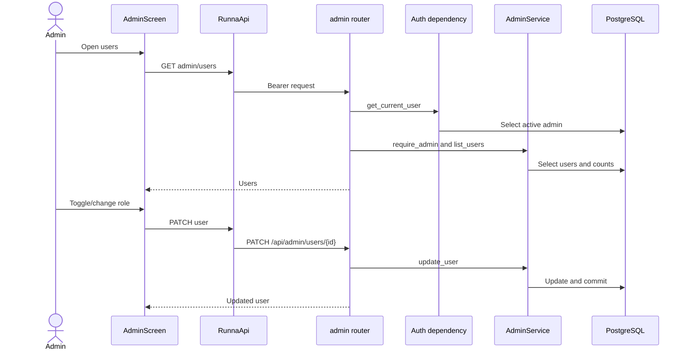
